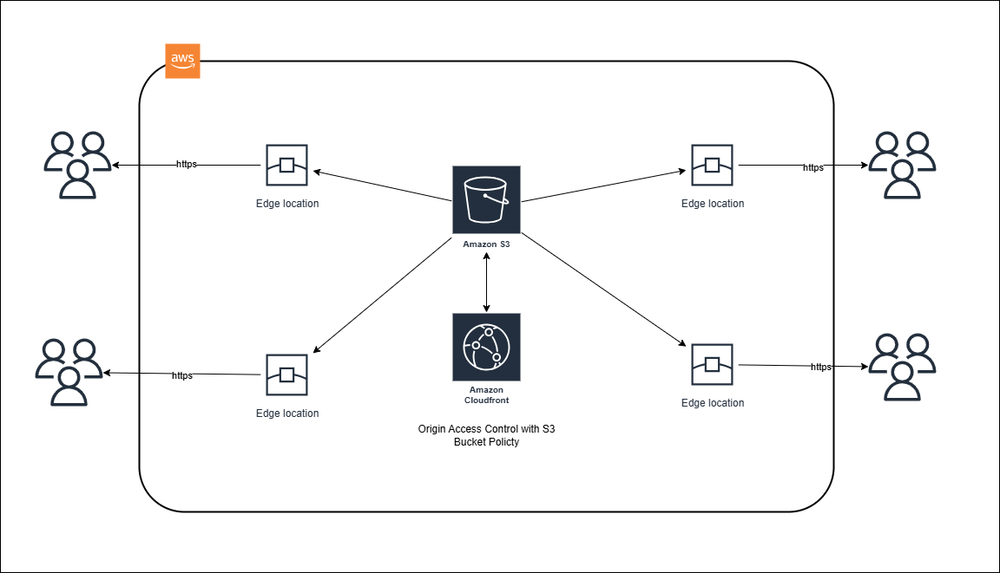
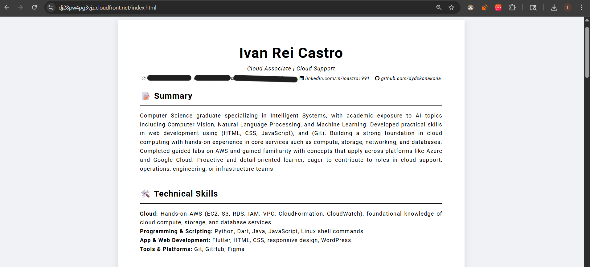
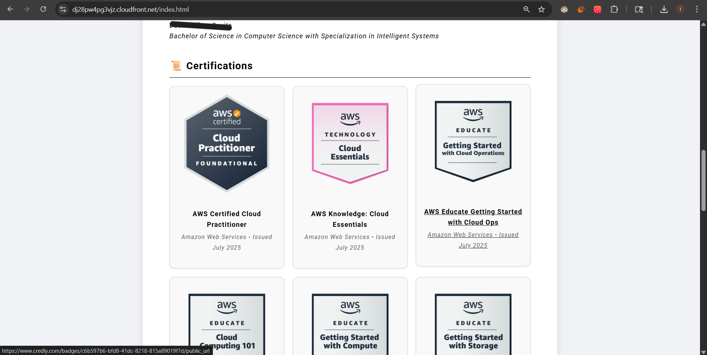
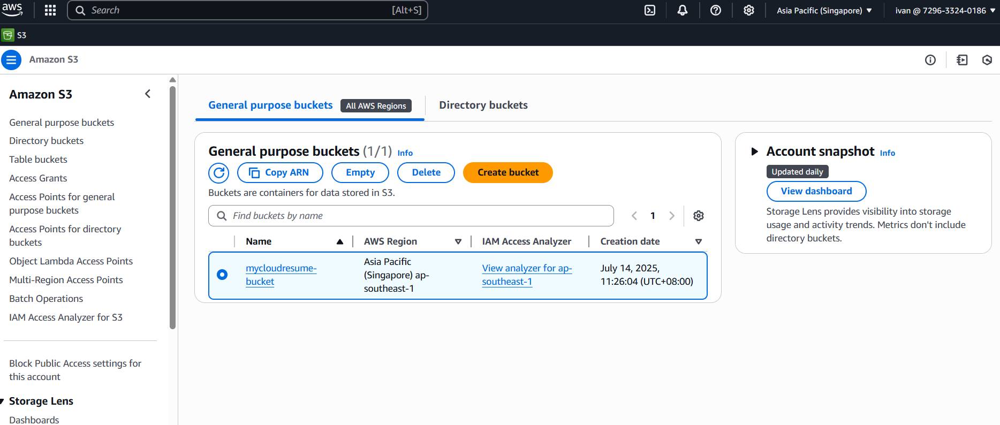
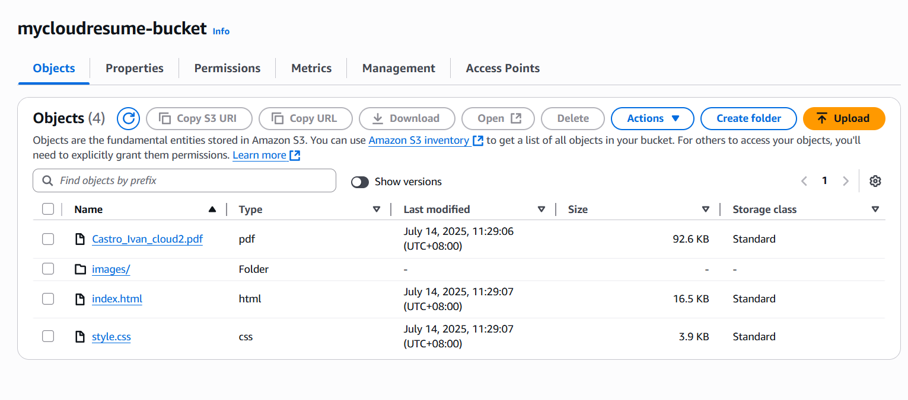
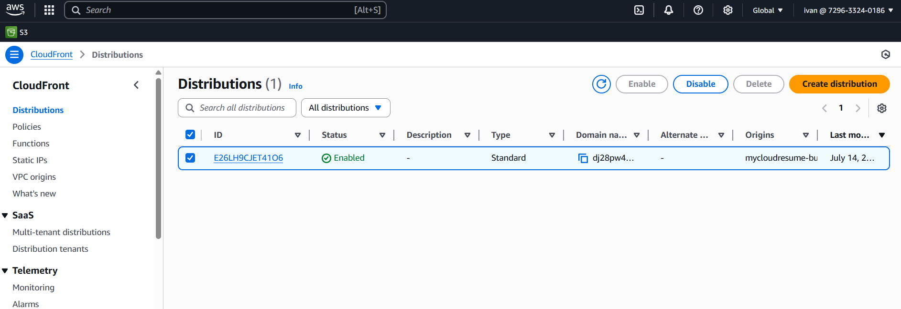
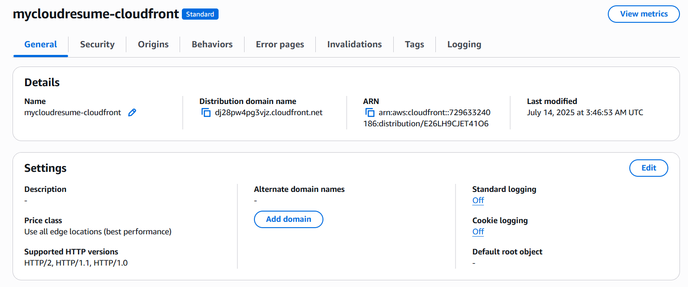

# Cloud Resume Challenge

## Overview

This project hosts a basic HTML/CSS resume page using an S3 bucket, served globally through a CloudFront distribution. It focuses on setting up static website hosting, configuring public access, and enabling content delivery through a CDN. All AWS resources were provisioned and managed using Terraform for infrastructure as code.

---

## Architecture

---

## Steps Taken

1. Wrote Terraform configuration to create the required AWS infrastructure.
2. Created an S3 bucket and uploaded static HTML/CSS files through Terraform.
3. Enabled static website hosting and configured proper bucket permissions.
4. Provisioned a CloudFront distribution with the S3 bucket as the origin.
5. Applied Terraform changes to deploy the infrastructure.
6. Verified the site was accessible via the CloudFront domain.
---

## Technologies Used

- **Terraform** – For infrastructure provisioning and automation
- **Amazon S3** – For static file storage and hosting
- **Amazon CloudFront** – For global content delivery
- **HTML / CSS** – For website content and styling

---

## Screenshots

  
  

  
  
  
  

---

## Notes

- All infrastructure was deployed and destroyed using Terraform to ensure reproducibility and avoid unnecessary costs.
- The site is hosted using only static content.
- This was a learning project to gain familiarity with AWS deployment basics and infrastructure as code practices.
