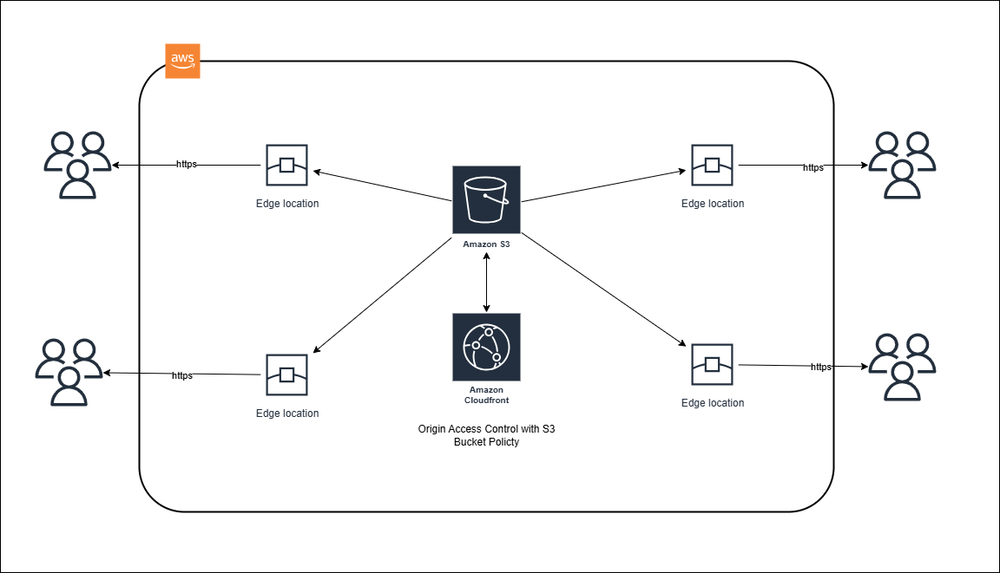
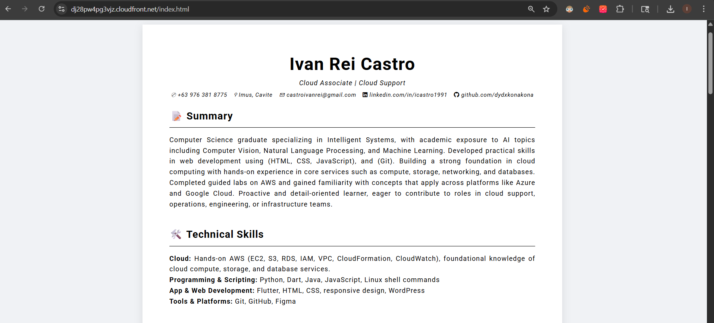
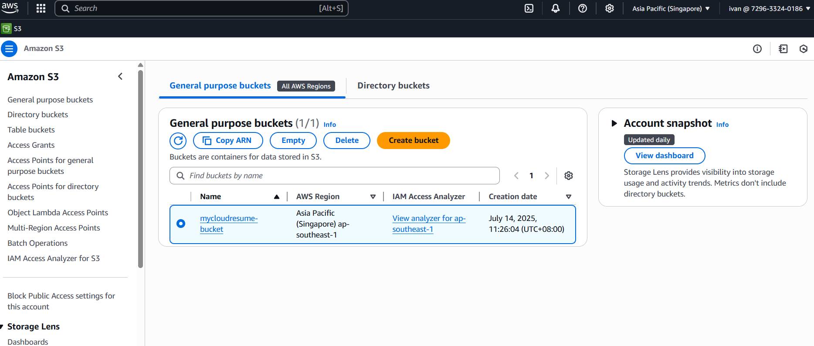
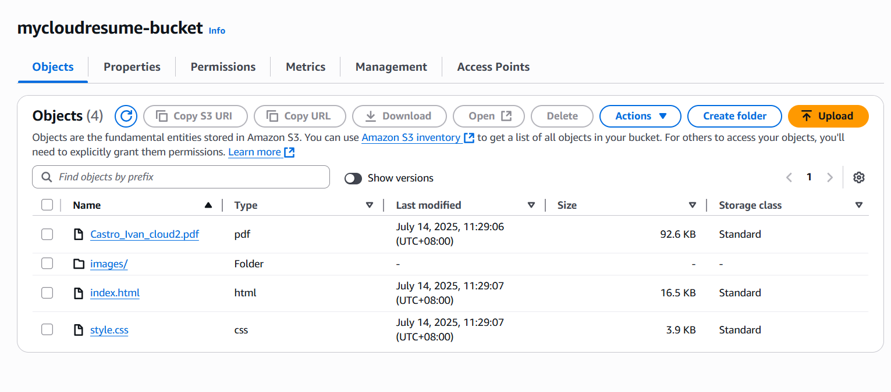
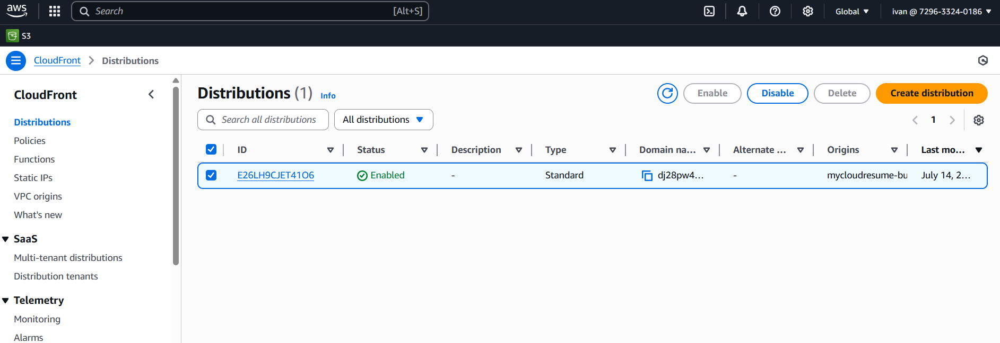
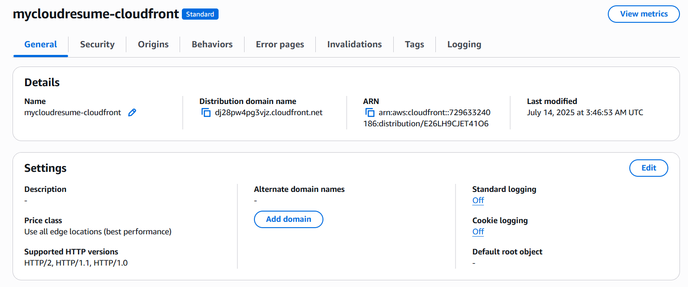

# Cloud Resume Challenge

## Overview

This project hosts a basic HTML/CSS resume page using an S3 bucket, served globally through a CloudFront distribution. It focuses on setting up static website hosting, configuring public access, and enabling content delivery through a CDN.

---

## Architecture

---

## Steps Taken

1. Created an S3 bucket and uploaded static HTML/CSS files.
2. Enabled static website hosting and set proper bucket permissions.
3. Set up a CloudFront distribution with the S3 bucket as origin.
4. Verified the site was accessible via the CloudFront domain.

---

## Technologies Used

- **Amazon S3** – For static file storage and hosting
- **Amazon CloudFront** – For global content delivery
- **HTML / CSS** – For website content and styling

---

## Screenshots

  
  

  
  
  
  

---

## Notes

- The site is hosted using only static content.
- This was a learning project to gain familiarity with AWS deployment basics.
- The project was cleaned up after by deleting CDN distributions and S3 buckets to avoid fees.

